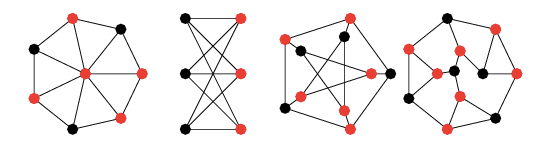

## Introduction and Background

In an increasingly connected world, more and more of the logistical problems we aim to solve as a society can be modeled over graphs. Urban planning, path scheduling, biological modeling and telecommunications are all domains that heavily utilize this abstraction in order to make their processes as efficient as possible.

However, doing so often requires solving a branch of problems known as **combinatorial optimization** over these graphs.

### What is combinatorial optimization?

Combinatorial optimization is a field in applied mathematics that explores the methods of finding some combination of objects that is optimal out of a finite set of such objects. This optimality is assessed by a cost function that maps each potential outcome to an associated cost, and the goal is to minimize that cost.

The most well-known example of combinatorial optimization is the **Traveling Salesman Problem (TSP)**. Let's say our traveling salesman wants to visit all of the countries in Scandinavia (N=3). This requires choosing between 6 possible paths for the financially optimal visiting order.

However, if we imagine scaling this problem to international supply chain networks, like all of the countries in Europe (N=44), there are now 2.6582716e54 potential paths.

This explosion in possibilities is a defining factor in NP-hard optimization problems. Several other highly applicable problems posed in graph theory suffer from the same issue.

### Selected Problems in Graph Theory

#### Minimum Vertex Cover:
A vertex cover is a set of vertices that includes at least one endpoint of every edge in the graph. For any given non-trivial graph there are many different vertex covers, but finding the minimum number of vertices needed to cover the graph is a common problem in graph theory.

The colored points above are examples of minimum coverings for those graphs.

####Maximum Cut:
A cut in a graph is a set of edges dividing the graph into two subsets. Another common problem in graph theory, with application to theoretical physics, is finding the maximum number of edges that can make up a cut.

The dotted line represents an example of the maximum cut of this graph.

The provided examples are only a small subset of the many extremely useful but computationally challenging graph optimization problems. In fact, of the 21 NP-complete problems in Richard Karp's formative paper [Reducibility Among Combinatorial Problems](https://pdfs.semanticscholar.org/a3c3/7657822859549cd6b12b0d1f76f8ee3680a0.pdf), more than half are decision versions of graph optimization problems or can be formulated on graphs.

This poses a significant limitation in applied contexts, since most industries do not have the computational power or resources to solve these problems at the rate and regularity at which results are needed.

### Standard Approaches

1. Exact algorithms
2. Approximation algorithms
3. Heuristics

Each has benefits and drawbacks, but they all lack the ability to take advantage of their frequent use on similarly structured datasets and problem instances in the real world. Even though the data might differ, the underlying problem frequently retains the same formulation in most applications. For example, directing electricity flow in a city utilizes the same network of electric wires and cables, but the demand and supply differs on a day to day basis, so very similar optimization problems will need to be solved for this instance every day.

There are hundreds of practical instances of combinatorial optimization problems over graphs whose domain-specific constraints require the use of customized, sophisticated algorithms in order to be solved in a reasonable amount of time. Because of the magnitude and complexity of these datasets, it often requires significant expertise in the field to assess when and how to use what algorithm.

Broadly speaking, the field of **reinforcement learning** has had a lot of success in capturing the subtle patterns and underlying structure in many complex datasets. Gameplay, like graph optimization, represents an extremely large and nuanced combinatorial search space and is a field where reinforcement learning algorithms have had terrific success. A famous example of this is [AlphaGo](https://www.nature.com/articles/nature16961), a reinforcement learning based algorithm that was able to beat the European Go champion 5 games to 0.

All of this suggests combinatorial optimization over graphs as a highly promising context for the application of data-driven algorithmic learning.
