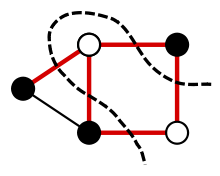
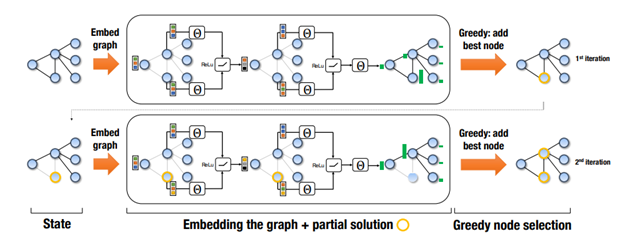
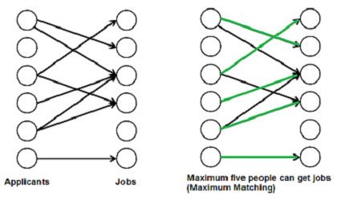

## Introduction and Background

In an increasingly connected world, more and more of the logistical problems we aim to solve as a society can be modeled over graphs. Urban planning, [social networks](https://www.cs.cornell.edu/home/kleinber/kdd03-inf.pdf), [healthcare modeling](https://www.cais.usc.edu/wp-content/uploads/2018/01/aamas_network_optimization.pdf) and [telecommunications](https://www.cs.cornell.edu/gomes/pdf/2011_dilkina_cpaior_shortest.pdf) are all domains that heavily utilize this abstraction in order to make their processes as efficient as possible.

However, doing so often requires solving a branch of problems known as **combinatorial optimization** over these graphs.

### What is combinatorial optimization?

Combinatorial optimization is a field in applied mathematics that explores the methods of finding some combination of objects that is optimal out of a finite set of such objects. This optimality is assessed by a cost function that maps each potential outcome to an associated cost, and the goal is to minimize that cost.

The most well-known example of combinatorial optimization is the **Traveling Salesman Problem (TSP)**. Let's say our traveling salesman wants to visit all of the countries in Scandinavia (N=3). This requires choosing between 6 possible paths for the financially optimal visiting order.

However, if we imagine scaling this problem to international supply chain networks, like all of the countries in Europe (N=44), there are now 2.6582716e54 potential paths.

This explosion in possibilities is a defining factor in NP-hard optimization problems. Several other highly applicable problems posed in graph theory suffer from the same issue.

### Selected Problems in Graph Theory

#### Minimum Vertex Cover:
A vertex cover is a set of vertices that includes at least one endpoint of every edge in the graph. For any given non-trivial graph there are many different vertex covers, but finding the minimum number of vertices needed to cover the graph is a common problem in graph theory.

The colored points above are examples of minimum coverings for those graphs.

####Maximum Cut:
A cut in a graph is a set of edges dividing the graph into two subsets. Another common problem in graph theory, with application to theoretical physics, is finding the maximum number of edges that can make up a cut.

The dotted line represents an example of the maximum cut of this graph.

The provided examples are only a small subset of the many extremely useful but computationally challenging graph optimization problems. In fact, of the 21 NP-complete problems in Richard Karp's formative paper [Reducibility Among Combinatorial Problems](https://pdfs.semanticscholar.org/a3c3/7657822859549cd6b12b0d1f76f8ee3680a0.pdf), more than half are decision versions of graph optimization problems or can be formulated on graphs.

This poses a significant limitation in applied contexts, since most industries do not have the computational power or resources to solve these problems at the rate and regularity at which results are needed.

### Standard Approaches

1. Exact algorithms
2. Approximation algorithms
3. Heuristics

Each has benefits and drawbacks, but they all lack the ability to take advantage of their frequent use on similarly structured datasets and problem instances in the real world.

Additionally, there are many practical instances of combinatorial optimization problems over graphs whose domain-specific constraints require the use of customized, sophisticated algorithms in order to be solved in a reasonable amount of time. Because of the magnitude and complexity of these datasets, it often requires significant expertise in the field to assess when and how to use what algorithm.

Broadly speaking, the field of **reinforcement learning** has had a lot of success in capturing the subtle patterns and underlying structure in many complex datasets. Gameplay, like graph optimization, represents an extremely large and nuanced combinatorial search space and is a field where reinforcement learning algorithms have had terrific success. A famous example of this is [AlphaGo](https://www.nature.com/articles/nature16961), a reinforcement learning based algorithm that was able to beat the European Go champion 5 games to 0.

All of this suggests combinatorial optimization over graphs as a highly promising context for the application of data-driven algorithmic learning.

## Foundational Research

The seminal paper in this field is Dai et al.'s [Learning Combinatorial Optimization over Graphs](https://arxiv.org/pdf/1704.01665.pdf). The work aims to make a general algorithm that can learn to solve all types of different graph optimization problems, since many of these problems have a similar underlying structure.

Since most graph optimization problems use a greedy algorithm, it would be great if ours did too. The only problem is that since we're trying to make an algorithm to solve *general* graph optimization problems, we need to find a way to learn an efficient heuristic for our optimization problem.

In comes ... [Q-learning](https://en.wikipedia.org/wiki/Q-learning)! This model uses a structure2vec representation of a graph embedding, allowing us to create an *evaluation function* $Q$ which is analogous to a heuristic function in a standard greedy approach. This function will be learned through reinforcement learning on many graph instances, without having example optimal solutions. The purpose of the function is to take in a partially constructed solution and a proposed node in the graph that is not already in the partial solution, and return some measure of the quality this node would add to our solution. Then we can use the standard greedy approach and simply pick the node that maximizes our evaluation function.

This naturally brings up a few questions:
1. How can we specify to our learning algorithm the constraints of our particular optimization problem?
2. How can we parametrize $Q$ so that it can use these constraints along with input data to find a sufficient evaluator function?
3. Once parametrized, how can we learn our $Q$ function without using data with ground truth labels?

We'll tackle these questions one at a time.

### Specifying a Problem

First, for any graph optimization problem, we can represent an instance of the problem as a graph $G$, which has a vertex set $V$, an edge set $E$, and a weight function $w : (V, V) \to \mathbb{R}$ where the input is a pair of vertices $(u, v) \in E$.

The we can specify an optimization problem by three components, a helper procedure $h$, a cost function $c$, and a termination criterion $t$. The purpose of the helper procedure is to take in a set of vertices $S$ and return a structure that is relevant to the problem. The cost function $c$ utilizes structures produced by $h$ to compute a metric of the quality of a partial solution $S$. The termination criterion $t$ determines when the algorithm can finally stop. Let's go through a couple examples of these functions for combinatorial problems we've already mentioned.

#### Minimum Vertex Cover (MVC)
The helper function wouldn't need to create any helper structures, since the cost could directly be computed as $c(h(S), G) = -\lvert S \rvert$ which favors smaller vertex covers. The termination $t(h(S), G)$ criterion would require that every vertex is covered, i.e. for every edge $(u, v) \in E$ we have $u \in S$ or $v \in S$.

#### Maximum Cut (MAXCUT)
For MAXCUT we would have $h(S)$ construct $\overline{S} = V / S$ (the complement of $S$) in order to construct a cut-set $C = \{(u, v) | (u, v) \in E, u \in S, v \in \overline{S}\}$ which facilitates computation of the cost of the cut. The cost itself is given by

$$c(h(S), G) = \sum_{(u, v) \in C} w(u, v)$$

which is the sum of all the edge weights which cross the cut. In this problem, there would be no termination criterion; instead the program would run until all every choice of proposed nodes to be added to the solution would not decrease the cut weight.

Now, let's move on to the next pressing question.

### Parametrizing an evaluator function

Using our previously mentioned technique of node embedding $\mu_v$, we can more rigorously specify our update step for the embedding:

$$\mu_v^{(t+1)} \leftarrow \text{relu}\left(\theta_1 x_v + \theta_2 \sum_{u \in \mathcal{N}(v)} \mu_u^{(t)} + \theta_3\sum_{u \in \mathcal{N}(v)} \text{relu}\left(\theta_4 w(v, u)\right)\right)$$

where denoting $p$ as the dimensionality of $\mu_v$, then we would have $\theta_1, \theta_4 \in \mathbb{R}^p$ and $\theta_2, \theta_3 \in \mathbb{R}^{p \times p}$ as the parameters to our embedding update step. Inside the [relu](https://en.wikipedia.org/wiki/Rectifier_(neural_networks)) function, the first term has a factor $x_v$, where $x_v = 1$ if $v \in S$, our partial solution set and $x_v = 0$ otherwise; this term accounts for the presence of the vertex in the solution set. The second term aggregates information about the adjacent vertices, which themselves contain information about their neighbors. The last term in the sum directly accounts for the weights of the edges connected to our vertex $v$. It's clear that after running this update procedure for $T$ steps, the embedding $\mu_v^{(T)}$ can contain information about vertices which are separated by up to $T$ edges away since we recursively sum over neighboring vertices' previous embeddings.

Now we can finally define our learned evaluator function $\hat{Q}$ as

$$\hat{Q}(h(S), v, \Theta) = \theta_5^{T}\text{relu}([\theta_6\sum_{u \in V} \mu_u^{(T)}, \theta_7 \mu_v^{(T)}])$$

where $\theta_5 \in \mathbb{R}^{2p}, \theta_6, \theta_7 \in \mathbb{R}^{p\times p}$. The collection of all $7$ $\theta$ variables form the total parametrization of the problem, given by $\Theta = \{\theta_i\}_{i=1}^7$. Inside the $\text{relu}$ layer, this formulation of $\hat{Q}$ concatenates the sum of all vertex embeddings with the embedding for a specific vertex $v$ ($[\cdot, \cdot]$ is the concatenation operator) allowing the evaluator to take into account both the state of the entire graph as well as the proposed vertex to be added to the partial solution. The variable $T$ is a hyperparameter of the algorithm, which as previously discussed, allows each vertex embedding to account for neighbors up to $T$ edges away.

This formulation looks pretty powerful! It contains a lot of aggregate information about the structure of the underlying graph, but it's still not clear how to find ideal parameters for our specific combinatorial problem.

### Q-Learning to the rescue!

Unlike previous work, our structure2vec formulation does not rely on ground truth labels. This means that we should have some reinforcement learning approach to training our parameters. Our reinforcement learning algorithm will have the following framework applicable to our problem formulation:

1. States: A collection $S$ of vertices in our proposed solution, with the goal of finding $\hat{S}$, the terminal solution. The vertices are represented by their embeddings.
2. Actions: The set of vertices $v \in V$ that are not part of our partial solution $S$. These vertices are also represented by their embeddings.
3. Transition: Adding a vertex $v \in V$ to our solution $S$, by changing $x_v$ from 0 to 1.
4. Rewards: We define the reward function in state $S$ of taking action $v$ as

$$r(S, v) = c(h(S \cup \{v \}), G) - c(h(S), G)$$

with $c(h(\varnothing), G) = 0$.

5. Policy: Choose $v$ such that $\pi(v | S) = \text{argmax}_{v' \in \overline{S}} \hat{Q}(h(S), v')$ which essentially chooses the vertex which maximizes the output of the evaluator function, indicating an optimal choice for the next vertex to add to the partial solution.

This framework defines a basic feedback loop that allows the learning algorithm, also called an agent, to learn to make decisions about what actions it should take to optimize its reward. It can change its behavior by changing the parameters in $\Theta$, which forces the algorithm to learn a good vertex embedding as well as a good evaluator function.

On an input graph $G$, the learning algorithm completes an *episode*, which is a complete solution $S$ after which no remaining action would increase the reward to the agent. The learning algorithm minimizes the squared loss by updating the parameters $\Theta$ according to the gradient of

$$[y - \hat{Q}(h(S_t), v_t, \Theta)]^2$$

when in a non-terminal partial solution given by $S_t$ after $t$ time steps. The target value $y$ is given by $\sum_{i=0}^{n-1} r(S_{t+i}, v_{t+i}) + \gamma \max_{v'} \hat{Q}(h(S_{t+n}), v'; \Theta)$. This paradigm is called $n$-step learning, since this target accounts for delayed rewards that the agent may not see immediately after every action. Both $n$ and $\gamma$, the factor by which to weigh the output of the evaluator function, are hyperparameters of this learning algorithm.

However, this formulation does not make clear which samples we train on. Do we train on a single $n$ length sequence from an episode or more? When does training occur? As the algorithm runs, it sores instances of its training steps as a tuple: $(S_t, a_t, R_{t, t+n}, S_{t+n})$ where $S_t$ and $S_{t+n}$ denote the state at time step $t$ and $t+n$ respectively, $a_t$ is the action taken at timestep $t$, and $R_{t, t+n}$ stores the cumulative reward in this timeframe: $R_{t, t+n} = \sum_{i=0}^{n-1} r(S_{t+i}, a_{t+i})$. Then batch stochastic gradient descent updates are performed on the parameters from a random sample of its *experiences* from $E$, a process which is called *experience replay*. After enough training on many episodes/experiences, we should find that the parameters in $\Theta$ reflect important aspects of the combinatorial optimization problem.

Wew, that was a lot of background. This entire paradigm is called Structure2Vec Deep Q-Learning, or S2V-DQN for short. Now that the idea of the research is laid out in front of us ...

### What's so good about this algorithm anyway?

Previous work done in machine learning based combinatorial optimization has been too restrictive for both scalability and application to a variety of problems. This network architecture in this novel method is general enough to be applied to different types of graph problems, and captures more of the combinatorial structure of the underlying graph compared to previous methods which used standard network architectures. Capturing the combinatorial structure by using the graph embedding also comes with the added benefit of scalability to larger graphs; whereas previous approaches needed to tailor the size of their input to match that of the network.

Another benefit comes from the process of $n$-step learning, allowing the evaluation function $Q$ to directly train on the objective function of the optimization problem, while still being able to account for delayed rewards that are not obvious to a standard greedy heuristic. Additionally, improved benefit is derived from the usage of experience replay, creating training samples with respect to the potential benefit of each node rather than the entire solution, allowing for many more sample instances to train on compared to a standard policy gradient approach, which only performs an update based on the entire solution.

These benefits are not just theoretical, the results speak for themselves! S2V-DQN was tested on TSP, MAXCUT, and MVC, and was even able to find a more optimal solution than a neural network based algorithm which was specifically designed to solve TSP; let alone being able to find near optimal solution for all 3 problems. The benefits don't stop there; the algorithm was empirically able to find near optimal solutions for graph sizes over 10 times larger than graphs it was trained on, and was able to do so slightly faster compared to other problem-specific algorithms which found similarly optimal solutions.

## Future Work

Since the publication of the Dai et al. paper, several potential extensions and improvements have been suggested to further the capabilities of data-driven algorithmic learning for graph optimization. To inform further exploration of this topic, we have outlined some of the identified weaknesses of the original research and relevant supporting papers.

### Eliminating Human Dependencies

One major pitfall that we noticed in the algorithm was the use of the helper function $h$. This function takes in a set of vertices $S$ and returns a structure that is relevant to the problem, and due to the fact that it is both human-designed and problem specific, reliance on it is a major limitation of this model.

In exploring strategies for eliminating this dependency, we came across the paper [Attention, Learn to Solve Routing Problems!](https://arxiv.org/pdf/1803.08475.pdf). The paper modifies aspects of a model architecture known as the [transformer](https://arxiv.org/abs/1706.03762) in order to create a graph embedding. Transformers have been used very successfully in [natural language processing](https://en.wikipedia.org/wiki/Natural_language_processing), which is another problem field that benefits significantly from removing assumptions about the data's structure. The model is then trained using reinforcement learning. Despite the significant improvements in performance over the methods from our original paper, we still have some doubts about the efficacy of this method due to the fact that it was only trained and evaluated on the order of 100 nodes.

This brings us to the next potential limitation for the field of reinforcement learning based combinatorial optimization for graphs.

### Scalability

The instances of the original model trained on 100 nodes generalized decently to 1200 nodes, but these numbers are still nothing in comparison to the scale of real-world networking problems. We searched through the existing literature to assess the scalability of the learning approach to graph optimization, and found [Learning Heuristics over Large Graphs via Deep Reinforcement Learning](https://arxiv.org/pdf/1903.03332.pdf). The paper uses a [graph convolutional neural network (GCN)](https://arxiv.org/pdf/1901.00596.pdf) instead of structure2vec for the graph embedding process, which was then trained using the Deep-Q Learning method that Dai et al. also used. The models were evaluated on the order of millions of nodes, and were able to outperform not only the standard heuristic approaches but also the dominant supervised learning based graph optimization algorithm. However, like our original model, this model also utilized a human-coded helper function for training their model.

### Extensibility

#### Datasets
The original paper used three real-world datasets for examining each of the three graph theory problems.

1. Minimum Vertex Cover (MVC): The authors used the [MemeTracker](http://snap.stanford.edu/netinf/#data) digraph, which describes how phrases move from one website to another.
2. Maximum Cut (MAXCUT): The authors chose 10 instances of Ising spin glass models.
3. Traveling Salesman Problem (TSP): The algorithm was tested on the standard TSPLIB [library](http://elib.zib.de/pub/mp-testdata/tsp/tsplib/tsp/index.html) for instances ranging from 51 to 318 cities.

One potentially interesting avenue of study is examining differently structured datasets to see how we might modify the original algorithm to be more robust to different structures, without the hand-coded helper function.

#### Graph Optimization Problems
In both the original paper and the other papers we examined in our research, the learning algorithms were primarily used on three specific graph problems and their variations: minimum vertex cover (MVC), maximum cut (MAXCUT), and the traveling salesman problem (TSP).

While these are three of the most broadly applicable graph theory problems, we believe that there is value in determining if and how the theory can be extended to other problems in the field i.e. maximum matching.

Green edges are the set of edges that allow the most vertices from the left side of the graph to be connected to the right.

### Final Thoughts
Based on our research, we believe that reinforcement learning algorithms show a lot of promise for providing significant computational benefits when applied to combinatorial optimization of graphs. Given the number of avenues for real-world applications of graphs, this computational benefit has the potential to convert to genuine financial and infrastructural improvement. Study in this domain is clearly still in the growth phase, but this means there is a lot of opportunity to expand and contribute to its development.
